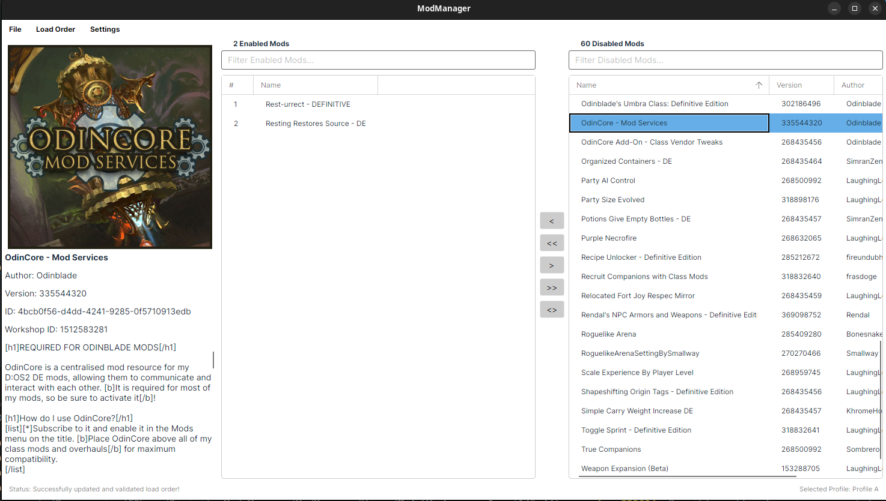
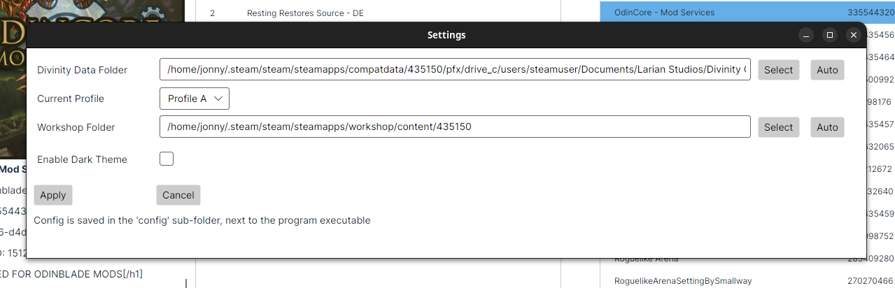

# Rivellon Mod Manager
NOTE! This app is a work in progress.

This Mod Manager supports Divinity: Original Sin 2, by Larian Studios.

This tool is cross-platform and supports any desktop operating system. It is developed and tested primarily on Linux (Ubuntu).

It was developed as a cross-platform alternative to LaughingLeader's Divinity Mod Manager for those who do not use Windows. Their mod manager is a fantastic tool and I highly recommend it for Windows users, but unfortunately it is infamously tricky to get running on non-Windows systems.

# Features
Currently, it supports:
* Profile selection
* Reading in "modsettings.lsx" files to obtain the current load order
* Reading and parsing the PAK files in the mods directory to obtain all available mods
* Re-ordering, enabling and disabling mods
* Dependency checking, and highlighting invalid mods
  * Example: missing dependency (disabled, or not installed), or dependency is loaded after the mod that needs it
* Saving and exporting the current load order to the target profile
* Saving and exporting the current load order to a JSON file
* Steam Workshop metadata retrieval and display

# Planned Features
Features that are planned, but not yet implemented, include:
* Importing mods from ZIP, PAK formats via the mod manager
* Script extender detection and management

# Credits
* [LaughingLeader](https://github.com/LaughingLeader) for their [Divinity Mod Manager](https://github.com/LaughingLeader-DOS2-Mods/DivinityModManager) and [BG3 Mod Manager](https://github.com/laughingleader/bg3modmanager) apps.
* [Norbyte](https://github.com/Norbyte) for [LSLib](https://github.com/Norbyte/lslib). This is used extensively to manage Larian's file formats.
* Larian Studios, for their excellent Divinity: Original Sin 2 game.
